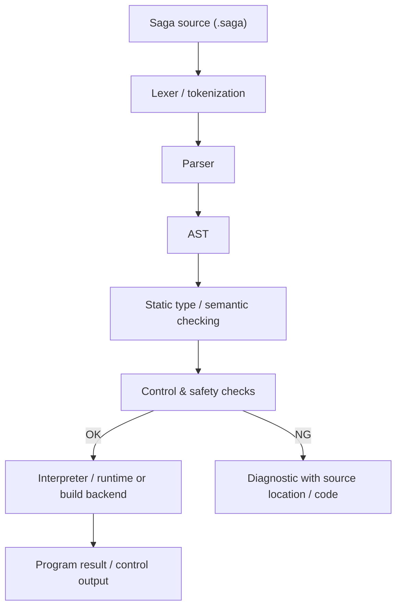
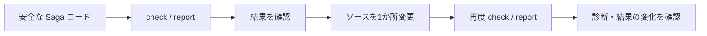

# Saga プログラミングフロー

この資料は、Saga のソースコードがどのように解析・検査・実行されるかを、コンテスト審査向けに1本の流れとして示すものです。

## 全体フロー



Saga は、既存言語のソースをそのまま渡して実行するラッパーではありません。独自の Saga ソースを読み取り、構文木を作り、静的検査を通したうえで実行またはビルドへ進む言語処理系です。

## 1. Saga ソースを書く

拡張子 `.saga` のソースに、関数、型、制御用アノテーションなどを記述します。

コンテスト向けの代表例:

```saga
@control_safe
fn clamp_command(value: decimal) -> decimal {
    if value > 1.0 { return 1.0 }
    if value < -1.0 { return -1.0 }
    return value
}

@control_tick(20000, 35)
fn current_tick(error: decimal) -> decimal {
    return clamp_command(error * 0.5)
}
```

`@control_tick(20000, 35)` は、20 kHz の周期経路と 35 µs のソースレベル予算をソース上に明示する例です。

## 2. 字句解析・構文解析

ソース文字列をトークンへ分解し、文法に従って AST（Abstract Syntax Tree / 抽象構文木）へ変換します。

AST に関する実装は `saga/ast_nodes.py` などから追えます。

ここで構文が成立しない場合は、実行へ進まず診断を返します。

## 3. 型・意味検査

構文として正しいだけではなく、型や意味の整合性を静的に確認します。

主要な検査実装は `saga/checker.py` から確認できます。

Saga の狙いは、「実行して初めて分かる問題」を可能な範囲で実行前に検出することです。

## 4. 制御・安全性の検査

機械制御向けの経路では、通常の型検査に加え、宣言された制御境界に対してソースレベルの制約を確認します。

例:

- 周期経路の周波数と予算がソースに明示されているか
- 制御経路へ隠れたブロッキング / 外部 I/O が入り込んでいないか
- 上限を決めにくい処理がないか
- 共有可変状態、再帰、間接呼び出し、未検証ヘルパーなどが制御経路へ入っていないか

関連する実装・出力:

- `saga/control_profile.py`
- `saga/control_report.py`
- `saga/control_report_html.py`
- `saga/diagnostics.py`

重要: これは**ソースコード上の検査**です。実機の WCET 測定、HIL、非常停止、安全回路、航空・機械分野の認証を置き換えるものではありません。

## 5. 診断または実行へ進む

検査に失敗した場合は、問題を診断として返します。コンテスト例では、危険なパターンの位置と安定した診断コードを示すことができます。

検査に成功したプログラムは、用途に応じて実行系またはビルド系へ進みます。

CLI の入口は `saga/cli.py`、外部から利用する API は `saga/api.py` から確認できます。

主な操作例:

```bash
saga check examples/contest/diff_safe_control.saga
saga run examples/contest/diff_safe_control.saga
saga-control-report examples/contest/diff_safe_control.saga
```

## 6. コンテストデモの検証フロー

提出動画では、処理系全体を長く説明するより、コード変更と結果の因果関係を短時間で見せます。



詳細な撮影順序はルートの `CONTEST_DEMO.md` を使用します。

## 7. 審査時に見ると分かりやすいファイル

| 目的 | ファイル |
|---|---|
| プロジェクト全体 | `README.md` |
| 提出版の要約 | `SUBMISSION_README_JA.md` |
| AST | `saga/ast_nodes.py` |
| 静的検査 | `saga/checker.py` |
| CLI | `saga/cli.py` |
| 制御プロファイル | `saga/control_profile.py` |
| 制御レポート | `saga/control_report.py` |
| 診断 | `saga/diagnostics.py` |
| コンテスト用検証 | `saga/contest_demo.py` |
| デモ手順 | `CONTEST_DEMO.md` |

## 8. Saga が言語として扱っている範囲

Saga リポジトリには、Lexer / Parser / AST、静的型検査、モジュール、ジェネリクス、`Option` / `Result`、`async` / `await`、リソース管理、診断、LSP、デバッグ、プロファイル、native / WASM 系のビルド機能など、独立した言語処理系としての機能が含まれています。

コンテストでは全機能を2分で見せるのではなく、**「Saga のソースを処理系が理解し、制御上の条件を実行前に検査できる」**という核を中心に見せます。
